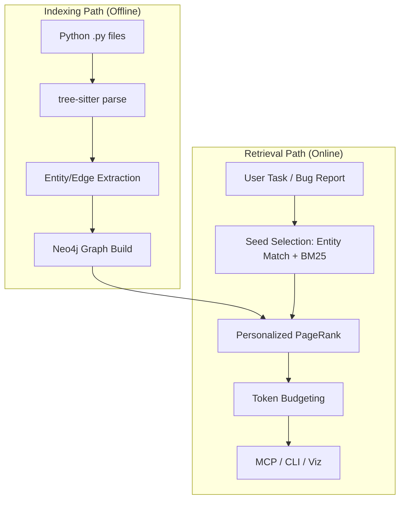

# System architecture

Structural context retrieval for AI coding agents. Code is a **structural dependency graph**; relevance is **Personalized PageRank (PPR)**, not embedding similarity.

Binding choices: [DECISIONS.md](../../DECISIONS.md). Module paths: [../reference/module-map.md](../reference/module-map.md).

---

## End-to-end pipeline

CodeGraph is conceptualized as two distinct functional flows: the **Indexing Path** (mapping code to graph) and the **Retrieval Path** (mapping tasks to context).

### Indexing Path (Offline)
1.  **tree-sitter parse** (`core/parser`)
2.  **entity/edge extraction** (File, Class, Function, Method)
3.  **Neo4j graph build** (`core/graph/graph_builder.py`)

### Retrieval Path (Online)
4.  **seed selection** (`core/retrieval/seed_selection.py`)
5.  **IDF edge reweighting** (`core/retrieval/post_processing.py`)
6.  **GDS Personalized PageRank** (`core/graph/ppr.py`)
7.  **token-budget formatting** (`core/retrieval/post_processing.py`)
8.  **Delivery**: MCP / CLI / Visualizer

---

## Trust & Transparency

CodeGraph provides three core trust signals to help agents and developers verify retrieval quality:

1.  **Seed Provenance**: Every retrieved entity explicitly identifies the "seeds" (entity names or text matches) that triggered its selection.
2.  **Traceable Paths**: The `explain` interface reveals the structural relationship between the task and the retrieved code.
3.  **Shared Retrieval Core**: Identical ranking logic powers the CLI, MCP, and visualizer.

---

## Stage 1: Parsing (Indexing Path)

- **Engine:** tree-sitter-python (`src/codegraph/core/parser/`)
- **Entities:** File, Class, Function, Method only
- **Identity:** `qualified_name = file_path + '::' + name`
- **Scope:** Python only; respects `exclude_patterns`, `.gitignore`-style rules, optional `.cgignore`

---

## Stage 2: Graph construction (Indexing Path)

- **Storage:** Neo4j 5.x + GDS
- **Writes:** Batched `UNWIND` + `MERGE`
- **Edges:** `CONTAINS`, `CALLS`, `IMPORTS`, `INHERITS_FROM`
- **Call resolution:** imported → same-file → unique global; **ambiguous callee → no edge**

---

## Stage 3: Seed selection (Retrieval Path)

| Signal | Default weight | Metadata `source` |
|--------|----------------|-------------------|
| Entity name match | 0.6 | `entity_match` |
| BM25 on task text | 0.3 | `bm25` |

- Task text is tokenized with compound splitting (`CamelCase`, `snake_case`).
- Entity names are also auto-extracted from the task string.
- `current_file` / active-file hints are **not** used (removed as unreliable).

Config: `seed_selection` in `config.yaml`. Details: [retrieval-pipeline.md](retrieval-pipeline.md).

---

## Stage 4: PPR (Retrieval Path)

- **Defaults:** `damping_factor=0.70`, `top_k=30`, `retrieval_mode=uniform`
- **IDF:** edge weight `1 / log2(in_degree + 2)` before projection; reset after run
- **Projection:** name `"codegraph"`, `UNDIRECTED`, relationship types above

Every retrieval calls `ensure_graph_ready()` — safe to repeat.

---

## Stage 5: Delivery (Retrieval Path)

- Ranked entities → source snippets with line ranges
- Token budget trimming (default 6000)
- **MCP:** two tools only
- **CLI:** query, explain, analyze, stats, doctor, visualize, watch
- **Visualizer:** FastAPI backend + React/D3 frontend on port 8474

---

## Evaluation snapshot

SWE-bench Lite (300 issues, file-level Recall@k). Thesis headline: **74.0% R@10**, 78 zero-recall — artifact [`evaluation/results/iteration_2_top_30/summary.json`](../../evaluation/results/iteration_2_top_30/summary.json) (see [../thesis/evaluation.md](../thesis/evaluation.md)).

---

## Limitations

- Python-only static analysis
- No type inference; dynamic imports / `eval` invisible
- Ambiguous calls intentionally dropped
- Primary indexing model: full `rebuild` (`watch` updates files but is not a full incremental graph product)

---

## Deep-dive topics

**Why four entity types?** File-only is too coarse; full AST is noisy and slow for PPR.

**Why uniform restart?** Weighted restart over-trusts a wrong seed; uniform lets structure redistribute mass.

**Why drop ambiguous CALLS?** False edges create spurious PPR paths worse than missing edges.

## Related deep-dives

| Topic | Doc |
|-------|-----|
| Graph schema | [graph-model.md](graph-model.md) |
| Parsing | [parser.md](parser.md) |
| CALLS linking | [call-resolution.md](call-resolution.md) |
| Neo4j + GDS | [neo4j-backend.md](neo4j-backend.md) |
| Ingest + watch | [how-it-works.md](how-it-works.md) |
| PPR + seeds | [retrieval-pipeline.md](retrieval-pipeline.md) |
| Why ranked? | [explainability.md](explainability.md) |
| SWE-bench | [../guides/evaluation-harness.md](../guides/evaluation-harness.md) |
| Module paths | [../reference/module-map.md](../reference/module-map.md) |
map.md) |
