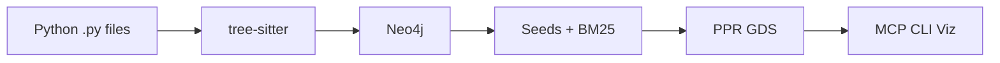

# System architecture

Graph-based context selection for AI coding agents. Code is a **structural dependency graph**; relevance is **Personalized PageRank (PPR)**, not embedding similarity.

Binding choices: [DECISIONS.md](../../DECISIONS.md). Module paths: [../reference/module-map.md](../reference/module-map.md).

---

## End-to-end pipeline

```
Source code
  → tree-sitter parse          (core/parser)
  → entity/edge extraction     (File, Class, Function, Method)
  → Neo4j graph build          (core/graph/graph_builder.py)
  → seed selection             (core/retrieval/seed_selection.py)
  → IDF edge reweighting         (core/retrieval/post_processing.py)
  → GDS Personalized PageRank    (core/graph/ppr.py)
  → token-budget formatting      (core/retrieval/post_processing.py)
  → MCP / CLI / Visualizer
```



---

## Stage 1: Parsing (offline)

- **Engine:** tree-sitter-python (`src/codegraph/core/parser/`)
- **Entities:** File, Class, Function, Method only (DEC-003)
- **Identity:** `qualified_name = file_path + '::' + name`
- **Scope:** Python only; respects `exclude_patterns`, `.gitignore`-style rules, optional `.cgignore`

---

## Stage 2: Graph construction (offline)

- **Storage:** Neo4j 5.x + GDS
- **Writes:** Batched `UNWIND` + `MERGE` (DEC-008)
- **Edges:** `CONTAINS`, `CALLS`, `IMPORTS`, `INHERITS_FROM` (DEC-009)
- **Call resolution:** imported → same-file → unique global; **ambiguous callee → no edge** (DEC-004)

---

## Stage 3: Seed selection (online)

| Signal | Default weight | Metadata `source` |
|--------|----------------|-------------------|
| Entity name match | 0.6 | `entity_match` |
| BM25 on task text | 0.3 | `bm25` |

- Task text is tokenized with compound splitting (`CamelCase`, `snake_case`).
- Entity names are also auto-extracted from the task string.
- `current_file` / active-file hints are **not** used (removed as unreliable).

Config: `seed_selection` in `config.yaml`. Details: [retrieval-pipeline.md](retrieval-pipeline.md).

---

## Stage 4: PPR (online)

- **Defaults (DEC-001):** `damping_factor=0.70`, `top_k=30`, `retrieval_mode=uniform`
- **IDF (DEC-005):** edge weight `1 / log2(in_degree + 2)` before projection; reset after run
- **Projection:** name `"codegraph"`, `UNDIRECTED`, relationship types above

Every retrieval calls `ensure_graph_ready()` — safe to repeat.

---

## Stage 5: Delivery (online)

- Ranked entities → source snippets with line ranges
- Token budget trimming (default 6000)
- **MCP:** two tools only (DEC-007)
- **CLI:** query, explain, analyze, stats, doctor, visualize, watch
- **Visualizer:** FastAPI backend + React/D3 frontend on port 8474

---

## Evaluation snapshot

SWE-bench Lite (300 issues, file-level Recall@k). Best configuration **~74% R@10** (see [../thesis/evaluation.md](../thesis/evaluation.md)). Do not cite stale numbers from old README snippets without checking thesis chapter 5.

---

## Limitations

- Python-only static analysis
- No type inference; dynamic imports / `eval` invisible
- Ambiguous calls intentionally dropped
- Primary indexing model: full `rebuild` (`watch` updates files but is not a full incremental graph product)

---

## Deep-dive topics

**Why four entity types?** File-only is too coarse; full AST is noisy and slow for PPR.

**Why uniform restart?** Weighted restart over-trusts a wrong seed; uniform lets structure redistribute mass (DEC-001).

**Why drop ambiguous CALLS?** False edges create spurious PPR paths worse than missing edges (DEC-004).

## Related deep-dives

| Topic | Doc |
|-------|-----|
| Graph schema | [graph-model.md](graph-model.md) |
| Parsing | [parser.md](parser.md) |
| CALLS linking | [call-resolution.md](call-resolution.md) |
| Neo4j + GDS | [neo4j-backend.md](neo4j-backend.md) |
| Ingest + watch | [how-it-works.md](how-it-works.md) |
| PPR + seeds | [retrieval-pipeline.md](retrieval-pipeline.md) |
| Why ranked? | [explainability.md](explainability.md) |
| SWE-bench | [../guides/evaluation-harness.md](../guides/evaluation-harness.md) |
| Module paths | [../reference/module-map.md](../reference/module-map.md) |
