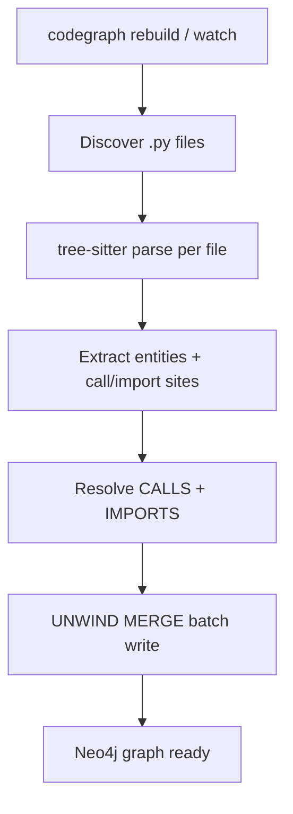

# Ingestion pipeline

How CodeGraph goes from Python files to a Neo4j graph. Retrieval is covered in [retrieval-pipeline.md](retrieval-pipeline.md).

---

## Flow



---

## 1. File discovery

- Root: `project_root` from `config.yaml` (resolved relative to config file location)
- Excludes: `exclude_patterns` in config, plus optional `.cgignore` (pathspec / gitignore-style)
- Test paths can be excluded from **seeds** via `seed_selection.exclude_seed_paths` (indexing may still include them unless excluded globally)

Entry: `parse_directory()` in `src/codegraph/core/parser/`.

---

## 2. AST extraction

- **tree-sitter-python** builds a concrete syntax tree per file
- Walkers emit frozen dataclass entities (DEC-002): File, Class, Function, Method
- Record line ranges, docstrings where extracted, call sites, import statements, class bases

Parser: `src/codegraph/core/parser/python_parser.py`.

---

## 3. Edge construction

- **CONTAINS:** structural nesting
- **IMPORTS:** resolved import targets where statically known
- **CALLS:** three-level resolver; ambiguous → skip
- **INHERITS_FROM:** base classes from class headers

Linker logic lives under `src/codegraph/core/parser/` and graph builder.

---

## 4. Neo4j write

- `clear_database()` on full rebuild
- Batched `UNWIND` + `MERGE` for nodes and relationships (DEC-008)
- Idempotent: re-running rebuild replaces content for the project

Builder: `src/codegraph/core/graph/graph_builder.py`.

---

## 5. Watch mode (incremental)

```bash
codegraph watch
```

On file change: re-parse affected files and update graph. **Not** a full incremental product like hash-level skip across entire monorepos — use `rebuild` after large refactors.

Implementation: `src/codegraph/cli/commands/watch.py`.

---

## 6. MCP auto-index

If MCP tools see an empty graph, they start a **background** rebuild thread (`src/codegraph/mcp/tools.py`). Prefer explicit `codegraph rebuild` for predictable demos.

---

## What ingestion does not do

- Type inference or points-to analysis
- JavaScript / Java / other languages (roadmap item)
- SCIP or LSP symbol indexes (unlike CodeGraphContext)
- Embedding generation

For multi-language patterns, see reference CGC docs under `docs/CodeGraphContext-Docs-From-Github/` only as inspiration, not behavior spec.
