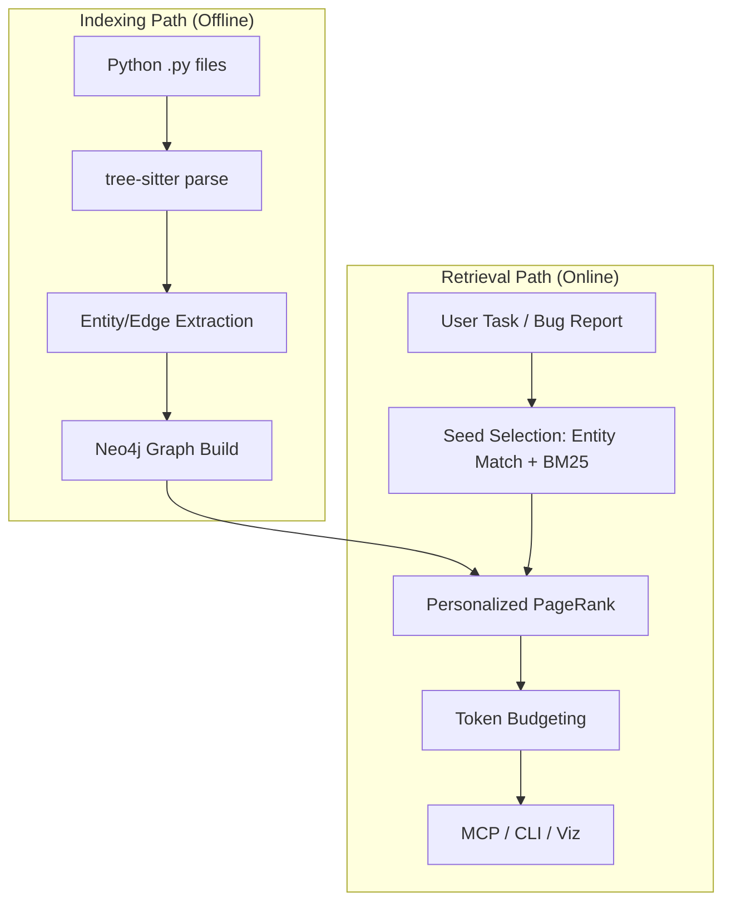

# Onboarding CodeGraph

Welcome to CodeGraph. This guide will help you understand the core mental model and get started with the CLI and MCP tools.

## The Mental Model: Structural vs. Lexical

Most search tools use **Lexical Search** (matching words) or **Vector Search** (matching meanings). CodeGraph uses **Structural Context Retrieval**.

- **Indexing Path**: CodeGraph parses your Python code into a graph of Classes, Functions, and Methods, connected by `CALLS`, `IMPORTS`, and `INHERITS_FROM` edges.
- **Retrieval Path**: When you provide a task, CodeGraph finds "seed" entities mentioned in your text and then follows the graph edges to find relevant code that lexical search would miss.

### Architecture Overview



## Minimal CLI Flow

Get up and running in three commands:

1.  **Index**: Build the structural graph of your project.
    ```bash
    codegraph rebuild
    ```
2.  **Query**: See what CodeGraph finds for a specific task.
    ```bash
    codegraph query "Fix the session timeout bug in AuthService"
    ```
3.  **Explain**: Understand *why* those files were retrieved.
    ```bash
    codegraph explain "Fix the session timeout bug in AuthService"
    ```

## Example: Structural Success

Consider a task: *"Fix the auth token validation bug."*

### Lexical Search (Failure)
A standard lexical search looks for the words "auth", "token", and "validation".
- It finds `api/auth.py`.
- It **misses** `utils/crypto.py` because that file contains the `TokenValidator` class but never uses the word "auth".

### CodeGraph (Success)
1. CodeGraph finds `api/auth.py` as a seed (text match).
2. It sees that `api/auth.py` **CALLS** `TokenValidator.verify()` in `utils/crypto.py`.
3. It traverses this edge and retrieves `utils/crypto.py` because it is structurally essential to the auth flow, even without a keyword match.

## Next Steps

- **MCP Integration**: Register CodeGraph as a tool for your AI agent (Claude, Cursor, etc.) using `codegraph install`.
- **Visualization**: Run `codegraph visualize` to explore your project's dependency graph in the browser.
- **Health Check**: Use `codegraph doctor` if you encounter any issues with Neo4j or the index.
